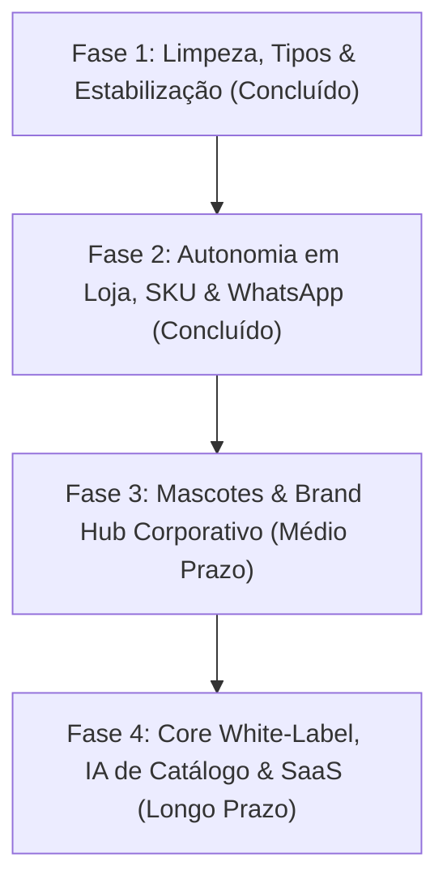

# 🗺️ Roadmap & Arquitetura Oficial: Coagro Studio

> **Diretriz Mestre:** O Coagro Studio é uma ferramenta focada em **resolver os gargalos operacionais internos do Grupo Coagro**, entregando autonomia de criação para lojas e setores com máxima estabilidade e simplicidade. Este documento estabelece as fronteiras do sistema para evitar dispersão de escopo (*efeito Frankenstein*), mapeia o estado real da aplicação e traça a trilha de evolução.

---

## 🎯 1. Visão, Fronteiras & Filosofia do Projeto

* **Onde o projeto começa:** Na necessidade da loja de anunciar um produto — entrada manual rápida ou importação de planilha de preços do ERP.
* **Onde o projeto termina:** Na entrega de um arquivo final de alta qualidade visual, 100% no padrão da marca, pronto para postagem (PNG) ou impressão física imediata (PDF A4).
* **Onde o projeto quer chegar:** Em um motor visual padronizado, resiliente (funciona online e offline), modular e preparado para evoluir para uma engine *white-label* (multi-filiais e multi-marcas).
* **Regra Anti-Frankenstein:** Nenhuma funcionalidade complexa (IA generativa pesada, vídeo, integrações externas) será liberada para os operadores antes que o fluxo essencial (manual + lote de cartazes + exportação limpa) esteja 100% estável e à prova de falhas.

---

## 🧭 2. Raio-X da Aplicação Atual (Estado Real — v1.0.1)

A aplicação está dividida em dois grandes módulos operacionais com suporte nativo a dois escopos de negócio (**Coagro Agro** e **Coagro Pet**):

### 📱 Módulo A: Redes Sociais (Feed & Stories)
| Funcionalidade | Estado | Descrição Técnica |
|---|---|---|
| **Editor Manual (`SocialManualEditor`)** | ✅ Ativo (Padrão) | Permite preenchimento direto de título, subtítulo, preços (DE / POR), diferenciais em tópicos, pílulas de CTA e seletor de tema/selo. |
| **Recorte de Imagem Client-side** | ✅ Ativo | Algoritmo em canvas (`imageTransparency.ts`) com remoção de fundo branco e detecção de contraste sem depender de API externa. |
| **Template Status Zap 9:16 (`WhatsappStatusVertical`)** | ✅ Ativo (Destaque) | Template focado em WhatsApp/Helena CRM com ícone oficial SVG, DE/POR monumental, degradês oficiais (Agro, Verde-Azul e Pet) e selo condicional. |
| **Template Promo Simples (`PromoSimples`)** | ✅ Ativo | Varejo rápido com tipografia monumental de preço DE/POR e compatibilidade com fotos sem recorte. |
| **Formatos de Canvas** | ✅ Ativo | Feed Quadrado (1:1), Feed Retrato (4:5) e Stories/Status (9:16). |
| **Biblioteca de Templates** | ✅ Ativo | Templates unificados e dedicados: `UnifiedCentral`, `UnifiedSplit`, `WhatsappStatusVertical`, `PromoSimples`, `PromoAgroA4`, `PromoPetA4`. |
| **Alternância Agro / Pet** | ✅ Ativo | Gerido via Zustand e `brand.config.ts`. Troca a quente sem vazamento de cores ou logos. |
| **Contraste Inteligente & Regras de Marca** | ✅ Ativo | Fundo claro proíbe terminantemente logo branca. Pet proíbe verde Agro. |
| **Matriz de Testes E2E** | ✅ Ativo | 15 cenários reais auditados via Chrome Headless CDP (`run-matrix-visual-tests.mjs`). |

---

### 🏷️ Módulo B: Cartazes de Loja (Encartes Físicos A4)
| Funcionalidade | Estado | Descrição Técnica |
|---|---|---|
| **Criação Individual (`PosterManualEditor`)** | ✅ Ativo | Entrada de Código/SKU, Título em caixa alta, Preço DE / POR e seletor de cabeçalho de destaque. |
| **Cabeçalhos de Destaque** | ✅ Ativo | Seleção rápida: *OFERTA, LIQUIDAÇÃO, PROMOÇÃO, SUPER PREÇO, ESPECIAL, NOVIDADE, PREÇO BAIXO*. |
| **Templates A4 Físicos** | ✅ Ativo | 3 opções operacionais: **Econômico P&B** (`promo-mono-a4`), **Tema Verde Agro** (`promo-agro-a4`) e **Tema Azul Pet** (`promo-pet-a4`). |
| **Processamento em Lote (`ExcelBatchUploader`)** | ✅ Ativo | Leitura direta de planilhas Excel (`.xlsx`/`.xls`) ou `.csv`, com detecção inteligente de colunas de código, produto e preços. |
| **Higienização de ERP & NFe** | ✅ Ativo | Tradução automática de abreviações técnicas (`erpSanitizer.ts`). |
| **Cache Local IndexedDB por SKU** | ✅ Ativo | Busca instantânea em 0ms (`productStorage.ts`). |
| **Exportação A4 (PNG & PDF)** | ✅ Ativo | Download de cartazes individuais em PNG ou geração de PDF A4 exato (210x297mm) via `jsPDF`. |

---

## ⏸️ 3. O que Está Pausado / Oculto no MVP (Com Justificativa)

Para garantir estabilidade e focar no que agrega valor imediato à ponta, certos recursos foram conscientemente pausados ou ocultos no código:

1. **🤖 Geração Automática por IA na UI (`socialMode === 'AI_BETA'`):**
   * *Status:* **Congelado / Oculto no Frontend** (`false &&` em `src/App.tsx`).
   * *Diretriz Operacional do Kaio:* A IA é um diferencial futuro que só será reabilitado quando os templates estiverem 100% validados e integrados a um banco estruturado de packshots por código de produto. A interface não deve prometer IA prematuramente na rotina manual da loja.
   * *Solução futura (Fase 4):* Motor de auto-preenchimento por catálogo vinculado a ERP ou modelo multimodal local.

2. **🎭 Mascotes da Marca:**
   * *Status:* **Pausado / Desabilitado**.
   * *Motivo:* Os componentes `UnifiedCentralWithMascot` e `UnifiedSplitWithMascot` tentavam encaixar os personagens no mesmo grid genérico dos produtos. Isso gerava deformação de proporção e conflito de hierarquia visual.
   * *Solução futura:* Serão reativados apenas em **templates exclusivos**, desenhados especificamente para a narrativa do mascote.

3. **🔍 Tela de Conferência/Revisão em Grade (`posterMode === 'REVIEW'`):**
   * *Status:* **Oculto no Frontend** (`false &&` em `src/App.tsx`).
   * *Motivo:* O componente `BatchReviewGrid.tsx` acumulava muitas responsabilidades e complexidade visual. O fluxo direto de lote (importar planilha -> selecionar modelo -> baixar) atende a loja com maior rapidez.

4. **🌄 Fundo Fotográfico por Prompt IA:**
   * *Status:* **Oculto no Frontend** (`false &&` em `src/App.tsx`).
   * *Motivo:* Fundos gerados por IA frequentemente poluíam o cartaz e prejudicavam a legibilidade das especificações técnicas do produto.

5. **☁️ Auto-save no Google Drive / Firebase:**
   * *Status:* **Inativo / Silencioso** (`triggerDriveAutoSave`).
   * *Motivo:* Exige autenticação OAuth nas máquinas das filiais, o que cria fricção para o operador de loja. O fluxo deve ser 100% local e direto.

---

## 📦 4. O que Foi Incrementado Recentemente

* **Arquitetura Multi-Tenant com Zustand:** Separação limpa dos escopos Agro e Pet em `src/config/tenant.config.json` e `src/store/tenantStore.ts`, garantindo que cores e marcas não se misturem.
* **Auditoria de Diretrizes de IA & Vocabulário:** Criação da matriz de tom em `server.ts` e documentação em `AUDITORIA_INSTRUCOES_IA.md` (bloqueio estrito de termos rurais no modo Pet e vice-versa).
* **Motor de Fallback Heurístico:** Criação de `server/services/heuristic.ts` para permitir geração de copys e regras mesmo na ausência de resposta da API do Gemini.
* **Tratamento e Normalização Monetária:** Implementação de `priceParser.ts` e `priceFormatter.ts` para tratar formatos brasileiros de moeda (`R$ 1.250,00`).
* **Blindagem de Repositório:** Configuração do repositório como Privado no GitHub e padronização do `README.md`.

---

## 🔨 5. O que Está no Meio do Desenvolvimento (WIP)

1. **Operação Híbrida 100% Offline:**
   * O Modo Manual já funciona sem internet para diagramação, mas os fluxos de build e dependências de fontes/assets externos ainda precisam de blindagem total para rodar mesmo se o sinal da loja cair completamente.
2. **Correção de Bugs Críticos de Renderização (Prioridade Imediata):**
   * **Persistência do Fundo Recortado:** Ao trocar repetidamente de template ou tema de cor, o canvas por vezes reexibe o fundo original não recortado.
   * **Alternância de Escopo sem Template:** Ao alternar de Agro para Pet sem um template explicitamente marcado, o layout por vezes carrega vazio ou desalinhado.
3. **Calibração de Layouts de Impressão:**
   * Ajuste fino das margens dos cartazes A4 para garantir que impressoras comuns de loja não cortem o cabeçalho nem o rodapé promocional.

---

## 🧹 6. Plano de Limpeza e Organização Estrutural (Anti-Frankenstein)

A aplicação cresceu rápido e acumulou dívida técnica que precisa ser saneada antes da adição de novos recursos:

### A. Modularização de Componentes Gigantes
* `InputPanel.tsx` possui ~1.900 linhas contendo formulários, chamadas de API, seletores visuais e regras de recorte. **Ação:** Dividir em subcomponentes atômicos (`ProductForm`, `PricingForm`, `TemplateSelector`, `ImageUploader`).
* `BatchReviewGrid.tsx` possui ~1.000 linhas de código atualmente oculto. **Ação:** Limpar ou arquivar em módulo separado de auditoria.

### B. Limpeza de Código Morto e Resíduos
* Expurgo de bibliotecas e funções não utilizadas herdadas de templates genéricos do Google/Vite.
* Remoção de referências a estilos legados (ex: tema `'branco'` solto sem tipagem).

### C. Unificação e Tipagem Estrita
* Centralização dos tipos de templates, temas e layouts em `src/types/agro.ts`.
* Garantir que `tenant.config.json` seja a única fonte da verdade para variáveis de cor e marca.

---

## 🚀 7. Próximos Passos Sugeridos (Trilha por Fases)

### 🔴 FASE 1: Limpeza, Estabilização e Correção de Bugs (Concluído)
* Saneamento de monólitos (`server.ts` decomposto, `useArtworkForm` desacoplado).
* Tipagem TypeScript estrita e 100% de fontes Exo 2 e Inter offline.
* Blindagem de marcas Agro ↔ Pet em `brand.config.ts`.

### 🟡 FASE 2: Refinamento de Operação em Loja & WhatsApp (Concluído)
* Cache Local IndexedDB com busca instantânea por código/SKU (`productStorage.ts`).
* Códigos de demonstração rápida (`00` para Pet e `01` para Agro).
* Template oficial `WhatsappStatusVertical.tsx` (9:16) com ícone SVG canônico, preço monumental e cabeçalho dinâmico (logo centralizada sem selo, ou logo à esquerda com selo de campanha à direita).
* Template `PromoPetA4.tsx` e unificação do preço em `PromoSimples.tsx`.
* Botão de Impressão Direta em 1 Clique (`window.print()`) no preview de cartazes A4.
* Matriz de testes visuais E2E com 15 cenários reais aprovados.

### 🟢 FASE 3: Cartazes de Gôndola, Brand Hub & Endomarketing (Ativa / Em Refinamento)
1. **🏷️ Otimização de Cartazes de Gôndola e Prateleira:**
   * **Inicialização Padrão Pragmática:** Abertura direta no módulo de **Cartazes de Loja (A4)** com o template **Econômico Preto e Branco (Laser P&B)** pré-selecionado (atende à realidade das lojas com impressoras monocromáticas).
   * **Tipografia Padronizada no Varejo:** Títulos em **Exo 2 Black 900** mais encorpada e aumentada nos 3 temas de cartazes (P&B, Agro e Pet).
   * **Logo Oficial no Rodapé A4:** Logomarca vertical oficial da Coagro com a casinha no topo fixa em todos os cartazes físicos.
   * **Cartaz Duplo (Meia-Folha A5 / 2 por folha A4 em Paisagem):** Folha A4 em formato deitado (297x210mm) dividida ao meio em dois cartazes verticais com linha guia de corte tracejada.
   * **Card Quadrado para Grade 4 por Folha A4:** Novo layout com proporção quadrada dedicado para etiquetas de gôndola compacta.
   * **Cálculo Dinâmico & Importação de % de Desconto (`XX% OFF`):** Selo dinâmico de economia (ex: `25% OFF`).

2. **📁 Módulo Brand Hub Corporativo (Central de Governança de Marca — Entregue):**
   * **Papel Timbrado Oficial Adaptável às 12 Filiais:**
     - *Seletor Dinâmico de Filial:* Matriz ou filiais (Arapiraca/Bananeira, Maceió/Jatiúca, Aracaju, Lagarto, Delmiro, etc.) injeta automaticamente Razão Social, CNPJ, IE, Endereço e Telefone da unidade.
     - *Modo Web (PDF/Print):* Impressão de folhas timbradas em branco para a bandeja da loja ou geração de comunicado oficial rápido de 1 página.
     - *Modo Word (.DOCX):* Download do modelo oficial do Microsoft Word com cabeçalho/rodapé travados e tipografia oficial.
   * **Central de Downloads de Ativos Oficiais:** Logos Coagro e Coagro Pet em SVG (vetor) e PNG 300 DPI, com hierarquia oficial de cores (Azul Coagro `#001C71` Primária Titular, Verde Safra `#004d40` Secundária, Ouro Safra `#ffab00` Acento, Azul Claro Pet `#4897D0` Apoio).
   * **Download Direto de Tipografia:** Botões de download dos pacotes de fontes oficiais Exo 2 e Inter (.zip do Google Fonts).
   * **Fundos Corporativos para Videoconferência (Meet / Teams 1920x1080):** 4 modelos oficiais padronizados:
     1. *Azul Titular Coagro (#001C71):* Logomarca vertical completa com a casinha no topo.
     2. *Campo Tecnológico (Agro Tech):* Identidade verde safra com linhas tecnológicas e acento ouro.
     3. *Verde Safra Institucional:* Símbolo da Casinha Coagro em alta definição com halo dourado.
     4. *Sala Executiva Clean:* Ambiente de reunião clean e contemporâneo com quadro institucional emoldurado na parede.
   * **Gerador de Avatar / Foto de Perfil WhatsApp & CRM:** Enquadramento circular oficial com aro da marca, suportando foto de colaborador ou setor.
   * **Upload Sincronizado de Foto:** Ao carregar a imagem do colaborador em qualquer campo, a foto é sincronizada instantaneamente entre a Assinatura de E-mail e o Avatar de WhatsApp.
   * **Gerador de Assinatura de E-mail (Padrão Outlook):** Formulário corporativo com cópia em HTML em 1 clique e exportação em PNG.
   * **Diretório Rápido das Filiais:** Consulta instantânea de CNPJ, endereço e contatos das lojas para emissão de notas e cadastros.
   * **Template de Apresentação Institucional (.PPT):** Modelo estruturado para reuniões corporativas.

### 🔵 FASE 4: Modularização White-Label, IA de Catálogo & SaaS (Longo Prazo)
1. **Core Desacoplado ("Sobrinho Studio"):** Motor genérico alimentado por arquivos de configuração de marca.
2. **IA Generativa Vinculada a Catálogo ERP:** Reabilitação da IA apenas quando integrada a banco de packshots reais indexados por SKU.
3. **Plataforma Web SaaS:** Migração para modelo Web robusto com controle de filiais e cotas.
4. **Multimídia & Vídeo Programático:** Geração de cartazes animados e carrosséis para Instagram via React Remotion.
5. **TV Corporativa & Mídia Indoor (Digital Signage 16:9):** Modo de exibição full-screen em loop para Smart TVs nas lojas.

---

*Documento mantido pela equipe de Desenvolvimento & Operações do Grupo Coagro.*
*Versão do Roadmap: 2.4.0 — Outubro/2026*

